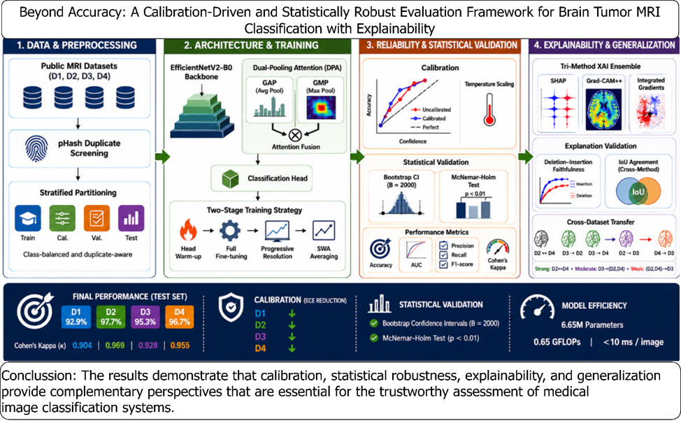

# Beyond Accuracy: A Calibration-Driven and Statistically Robust Explainable Deep Learning Framework for Brain Tumor MRI Classification

# Graphical Abstract


**Author:** Ibrahim Hayatu Hassan

---

## Experimental Overview 

This repository contains the full implementation for the paper *"Beyond Accuracy: A Calibration-Driven and Statistically Robust Explainable Deep Learning Framework for Brain Tumor MRI Classification"*. The framework targets the limitations of accuracy-only evaluation in medical imaging by combining:

- **EfficientNetV2-B0** backbone with a custom **Dual-Pooling Attention (DPA)** head
- **Post-hoc temperature scaling** calibration on a dedicated, leakage-safe calibration split
- **Perceptual-hash (pHash) duplicate screening** with group-level stratified partitioning to prevent cross-partition leakage
- **Bootstrap 95% confidence intervals** (B = 2,000) on all reported metrics
- **Holm-Bonferroni corrected McNemar tests** against 7 baseline architectures
- **Multi-method XAI ensemble** (SHAP, Grad-CAM++, Integrated Gradients) with top-10% IoU agreement and deletion/insertion AUC
- **Selective prediction** (risk-coverage) analysis

All numerical claims in the manuscript are traceable to `outputs file/<DATASET>/experiment_summary.json`.
---

## Repository Structure

```
beyond-accuracy/
├── beyond-accuracy.ipynb       # Main notebook (Kaggle-ready, GPU recommended)
├── requirements.txt            # Python dependencies
├── environment.yml             # Conda environment specification
├── REPRODUCE.md                # Step-by-step reproduction guide
├── outputs_pytorch/            # Auto-created; all results written here
│   └── <DATASET>/
│       ├── experiment_summary.json
│       ├── <DATASET>_phash_group_split.csv
│       ├── <DATASET>_phash_dedup_report.json
│       ├── <DATASET>_phash_candidate_pairs.csv
│       ├── best_effnetv2_bt_pytorch.pth
│       ├── final_model_v5_pytorch.pth
│       ├── final_model_v5_calibrated_pytorch.pth
│       └── *.pdf               # Figures
└── .github/
    └── workflows/
        └── smoke_test.yml      # CI smoke-test (5 epochs, 2 folds)
```

---

## Datasets

The notebook supports four datasets, selected via the `DATASET` variable at the top of the notebook:

| Key | Name | Classes | Source |
|-----|------|---------|--------|
| `D1` | Kaggle SARTAJ | 4 | [Kaggle](https://www.kaggle.com/datasets/sartajbhuvaji/brain-tumor-classification-mri) |
| `D2` | BRISC-2025 | 4 | [Kaggle](https://www.kaggle.com/datasets/briscdataset/brisc2025) |
| `D3` | Figshare (Cheng 2017) | 3 | [Kaggle](https://www.kaggle.com/datasets/denizkavi1/brain-tumor) |
| `D4` | Nickparvar (Combined) | 4 | [Kaggle](https://www.kaggle.com/datasets/masoudnickparvar/brain-tumor-mri-dataset) |

Attach the desired dataset to your Kaggle notebook before running. The loader auto-detects the folder layout (`Training/Testing/`, `train/test/`, or flat).

---

## Quickstart

### Option A — Kaggle (recommended, free T4 GPU)

1. Upload `beyond-accuracy.ipynb` to [kaggle.com/code](https://www.kaggle.com/code).
2. Attach the desired dataset (see table above).
3. Set `DATASET = "D1"` (or D2/D3/D4) and `SMOKE_TEST = False`.
4. Set accelerator to **GPU T4 x2** and run all cells.

### Option B — Local / Colab

```bash
git clone https://github.com/<your-username>/beyond-accuracy.git
cd beyond-accuracy
conda env create -f environment.yml
conda activate beyond-accuracy
jupyter notebook beyond-accuracy.ipynb
```

Set `DATASET` and point `Config.DATASET_DIR` to your local data path.

---

## Reproducing Results

See [`REPRODUCE.md`](REPRODUCE.md) for the exact sequence of steps, expected runtimes, and how to verify outputs against the manuscript tables.

**Key configuration variables** (top of notebook, change only these between runs):

```python
DATASET    = "D2"    # "D1" | "D2" | "D3" | "D4"
SMOKE_TEST = False   # True → ~10-min sanity run; False → full ~12h canonical run
```

---

## Data Integrity: pHash Duplicate Screening

All images are first pooled across provider-defined splits, hashed with a 64-bit DCT perceptual hash (H=8, δ≤6 Hamming distance), and grouped before any partition is formed. This prevents exact or near-duplicate images from appearing in more than one of the train/cal/val/test subsets.

Three audit files are written per dataset run:

| File | Contents |
|------|----------|
| `<D>_phash_group_split.csv` | Per-image partition assignment and group ID |
| `<D>_phash_candidate_pairs.csv` | All exact and near-duplicate pairs with Hamming distances |
| `<D>_phash_dedup_report.json` | Summary statistics and leakage-check result |

---

## Outputs

Every run produces a `experiment_summary.json` containing all manuscript-reported numbers:

```json
{
  "dataset_key": "D2",
  "splits": { "n_train": ..., "n_cal": ..., "n_val": ..., "n_test": ... },
  "test_calibrated": { "acc": ..., "f1": ..., "auc": ... },
  "bootstrap_ci_calibrated": { "Accuracy": { "point": ..., "ci_low": ..., "ci_high": ... }, ... },
  "calibration": { "ece_uncalibrated": ..., "ece_calibrated": ..., "optimal_T": ... },
  "mcnemar_holm": [ { "baseline": "ResNet50", "p_raw": ..., "p_holm": ..., ... }, ... ],
  "xai": { "iou_per_class": ..., "deletion_insertion_auc": ... },
  ...
}
```

---

## Citation

If you use this code, please cite:

```bibtex
@article{hassan2025beyondaccuracy,
  title   = {Beyond Accuracy: A Calibration-Driven and Statistically Robust
             Explainable Deep Learning Framework for Brain Tumor MRI Classification},
  author  = {Hassan, Ibrahim Hayatu},
  year    = {2026},
  note    = {Manuscript under review}
}
```

---

## License

This code is released for academic reproducibility. See [LICENSE](LICENSE) for terms.
